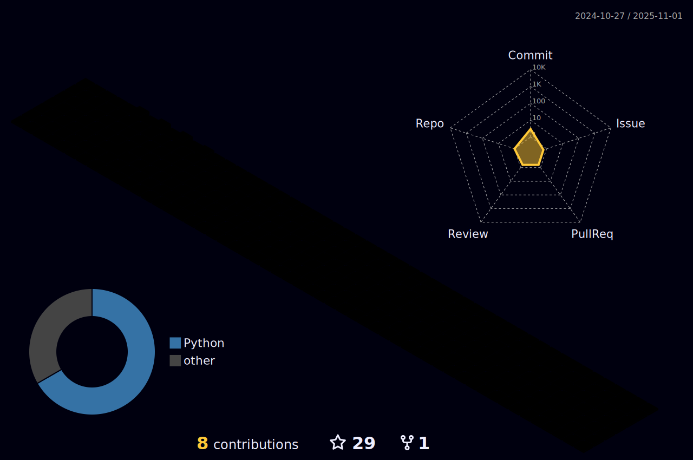

    
  

<h2> 👦 Kyle Huang | ğŸ–¥ï¸ AI Learner | 🌠GuangZhou , China </h2>

  
  
  
  
  
  
  
  
  
  

<picture>
  <source media="(prefers-color-scheme: dark)" srcset="./profile-snake-contrib/github-contribution-grid-snake-dark.svg" />
  <source media="(prefers-color-scheme: light)" srcset="./profile-snake-contrib/github-contribution-grid-snake.svg" />
  
</picture>

   <h1>Hi there, I'm Kyle Huang!  </h1>

🧑‍🎓 I am a sophomore at Northwestern Polytechnical University in China. </h3>

 

## 👀 About Me

 - 📖 Learning AI & Automation.
    
 - 🔭 I love coding, reading, traveling.

 - 🛸 AI is changing the world.
 
 - I do everything I love to do :heart:
 
 - ⭐ I'm always full of energy ⭐
 
 - 💬 Connect? lets get my email 💌 yonglehuang@mail.nwpu.edu.cn

  <h2> </h2>
  <h2> 🏃 Leanring and Keep going! </h2>

<!--  -->

 
<!--
**KyleHuang9/KyleHuang9** is a ✨ _special_ ✨ repository because its `README.md` (this file) appears on your GitHub profile.

Here are some ideas to get you started:

- 🔭 I’m currently working on ...
- 🌱 I’m currently learning ...
- 👯 I’m looking to collaborate on ...
- 🤔 I’m looking for help with ...
- 💬 Ask me about ...
- 📫 How to reach me: ...
- 😄 Pronouns: ...
- ⚡ Fun fact: ...
-->
